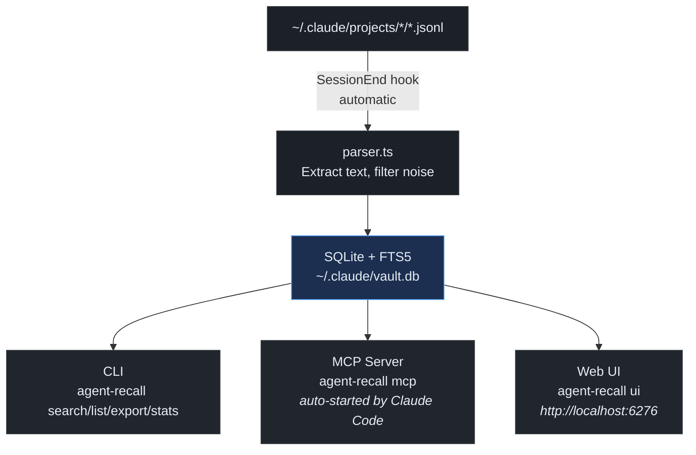

# agent-recall

A CLI + MCP server that archives coding agent session history into SQLite for full-text search.

## Why

Claude Code stores conversations as JSONL files under `~/.claude/projects/`, but old sessions are automatically deleted and `/compact` loses detail. agent-recall automatically archives sessions on exit so you can search and reference past conversations anytime.

## Features

- **Auto-archive** -- SessionEnd hook saves sessions automatically on exit
- **Full-text search** -- Fast search powered by SQLite FTS5 with Porter stemmer
- **Noise filtering** -- Strips tool_use / tool_result / thinking, keeping only conversation text (~7% of raw data)
- **Idempotent** -- UUID-based deduplication; safe to import repeatedly
- **MCP server** -- Agents can autonomously search past sessions via `recall_search`, `recall_list`, `recall_export`, `recall_stats` tools
- **Web UI** -- Browse sessions and chat history in the browser
- **Zero dependencies** -- Single binary via `deno compile`; no external services

## Install

Downloads precompiled binaries from GitHub Releases. No runtime dependencies needed.

```bash
# curl
curl -fsSL https://raw.githubusercontent.com/babarot/agent-recall/main/bin/install.sh | bash

# deno
deno run -A https://raw.githubusercontent.com/babarot/agent-recall/main/bin/install.ts
```

### Build from source

Requires [Deno](https://deno.com/) 2.x.

```bash
git clone https://github.com/babarot/agent-recall.git
cd agent-recall
deno task compile && cp agent-recall ~/.claude/agent-recall
```

### Hook Setup (auto-archive on session exit)

Add to `~/.claude/settings.json`:

```json
{
  "hooks": {
    "SessionEnd": [
      {
        "hooks": [
          {
            "type": "command",
            "command": "$HOME/.claude/agent-recall import 2>/dev/null",
            "async": true
          }
        ]
      }
    ]
  }
}
```

### MCP Server Setup (agent-autonomous search)

Register the MCP server so agents can search past sessions autonomously:

```bash
claude mcp add agent-recall -s user -- ~/.claude/agent-recall mcp
```

This exposes 4 tools to the agent:

| Tool | Description |
|------|-------------|
| `recall_search` | Full-text search across past sessions |
| `recall_list` | List archived sessions |
| `recall_export` | Export a specific session's full conversation |
| `recall_stats` | Show archive statistics |

Agents will call these tools on their own when they need context from past conversations.

## Usage

```bash
# Import all sessions
agent-recall import

# Full-text search
agent-recall search "terraform module"

# Filter by project and date
agent-recall search "deploy" --project oksskolten --from 2026-03-01

# List sessions
agent-recall list
agent-recall list --project gh-infra --format json

# Export a session as Markdown
agent-recall export <session-id>
agent-recall export <session-id> --format json --output session.json

# Show statistics
agent-recall stats

# Web UI
agent-recall ui                    # Start in background (default port: 6276)
agent-recall ui --foreground       # Start in foreground
agent-recall ui --port 8080        # Custom port
agent-recall ui status             # Show server status
agent-recall ui stop               # Stop the server
```

### Import

```
agent-recall import [options]

Options:
  --session <uuid>    Import a specific session
  --project <name>    Import sessions for a specific project
  --dry-run           Show what would be imported without writing
```

### Search

```
agent-recall search <query> [options]

Options:
  --project <name>    Filter by project
  --limit <n>         Max results (default: 20)
  --from <date>       Start date (YYYY-MM-DD)
  --to <date>         End date (YYYY-MM-DD)
  --format text|json  Output format (default: text)
```

Supports FTS5 query syntax: `"exact phrase"`, `term1 AND term2`, `term1 OR term2`, `term1 NOT term2`

### List

```
agent-recall list [options]

Options:
  --project <name>    Filter by project
  --limit <n>         Max sessions (default: 50)
  --format text|json  Output format (default: text)
```

### Export

```
agent-recall export <session-id> [options]

Options:
  --format markdown|json|text  Output format (default: markdown)
  --output <file>              Write to file instead of stdout
```

Session ID supports prefix matching -- `export a1b2` works.

### Stats

```
agent-recall stats [options]

Options:
  --project <name>    Filter by project
```

### UI

```
agent-recall ui [options]

Options:
  --port <n>          Port number (default: 6276)
  --foreground        Run in foreground instead of background

Subcommands:
  agent-recall ui stop     Stop the running server
  agent-recall ui status   Show server status
```

Opens `http://localhost:6276` with session browser, chat viewer, and search.

## Architecture

agent-recall is a single binary (`~/.claude/agent-recall`) with three interfaces:

| Interface | How it starts | Purpose |
|-----------|--------------|---------|
| **Hook** | Automatically on every Claude Code session exit (`SessionEnd` hook) | Archives sessions to SQLite |
| **MCP** | Automatically when Claude Code starts (registered via `claude mcp add`) | Lets agents search past sessions autonomously |
| **CLI** | Manually by the user (`agent-recall search ...`) | Search, list, export, stats from the terminal |
| **Web UI** | Manually by the user (`agent-recall ui`) | Browse sessions and chat history in the browser |



### DB Schema

```sql
sessions (session_id, project, project_path, git_branch, first_prompt,
          summary, message_count, started_at, ended_at, claude_version)

messages (id, session_id, uuid, role, content, timestamp, turn_index)

messages_fts (content)  -- FTS5, porter unicode61 tokenizer
```

### Filtering

| Stored | Excluded |
|--------|----------|
| User text | tool_use |
| Assistant text | tool_result |
| | thinking |
| | system (turn_duration, etc.) |
| | file-history-snapshot |
| | isSidechain = true |

## Global Options

```
--db <path>   Database file path (default: ~/.claude/vault.db)
--help        Show help
```

## Development

```bash
# CLI
deno task dev -- search "query"

# MCP server (stdio)
deno task dev -- mcp

# Web UI (frontend dev server + API server)
deno task ui:dev               # Vite dev server (port 5173, proxies /api to 6276)
deno task dev -- ui --foreground  # API server (port 6276)

# Build UI assets
deno task ui:build             # Vite build → ui/dist/
deno task ui:embed             # Embed ui/dist/ → src/ui_assets.ts

# Compile and install
deno task compile
deno task install

# Tests
deno task test
```

## Tech Stack

- [Deno](https://deno.com/) 2.x
- `node:sqlite` (DatabaseSync, built-in)
- SQLite FTS5
- `@std/cli`, `@std/fmt`, `@std/path`
- [Preact](https://preactjs.com/) + [Vite](https://vitejs.dev/) + [Tailwind CSS](https://tailwindcss.com/) (Web UI)
- [marked](https://marked.js.org/) (Markdown rendering)

## License

MIT
