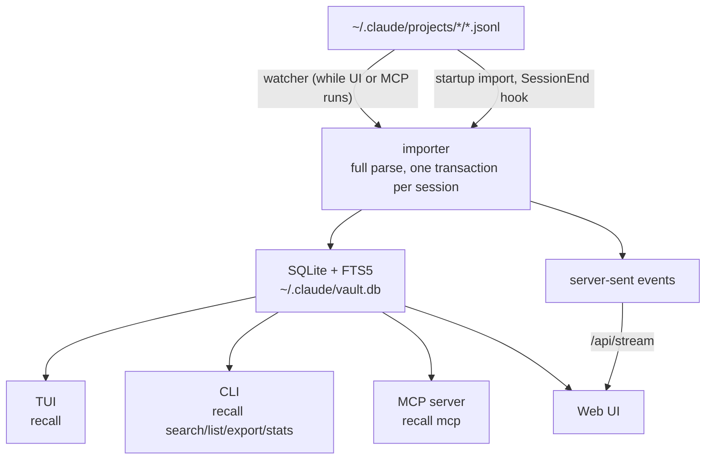

# claude-recall

[](https://github.com/babarot/claude-recall/actions/workflows/test.yaml)

A searchable archive of your Claude Code sessions: a TUI to find a past session, a CLI, an MCP server for agents, and a live web UI, all on SQLite FTS5 in one binary called `recall`.

## Why

Claude Code stores conversations as JSONL files under `~/.claude/projects/`, but old sessions are deleted after a while and a closed session is hard to find again. claude-recall archives every session into SQLite so you can browse, search and reference past conversations anytime, including ones whose JSONL is already gone.

Put simply, claude-recall is a recall tool, not a memory system. The goal is to make `grep ~/.claude/projects/**/*.jsonl` a better experience. Nothing more, nothing less. When you or the agent realize something was discussed before, you look it up.

## Why not just [claude-mem](https://github.com/thedotmack/claude-mem)?

[claude-mem](https://github.com/thedotmack/claude-mem) is an excellent project solving a related problem, and if it fits your workflow, you should use it. claude-recall deliberately solves a different one.

claude-mem extends the agent's memory. It captures observations on every tool use, summarizes them with an LLM into structured facts, stores them in a vector DB, and injects the result into the next session's prompt. It runs a resident worker, depends on Bun, Python and Chroma, and calls external LLM APIs during indexing.

claude-recall doesn't touch the memory layer. It takes the JSONL files Claude Code already writes, stores them in SQLite, and exposes FTS5 full-text search through a TUI, a CLI and an MCP server. When the agent needs to know what happened last time, it calls `recall_search` like any other tool. Nothing is auto-injected and nothing is summarized by an LLM.

|  | claude-mem | claude-recall |
|---|---|---|
| Goal | Extend the agent's memory | Help you and the agent recall |
| Injection | Push (auto-injected at `SessionStart`) | Pull (looked up when needed) |
| What's stored | LLM-summarized observations | Raw user and assistant text, noise-stripped |
| Search | FTS5 + Chroma vector hybrid | FTS5 only (deterministic) |
| LLM calls during indexing | Yes | None |
| Runtime | Node + Bun + Python (uv) + Chroma, resident worker | One static binary, no daemon |
| License | AGPL-3.0 | MIT |

The tradeoff claude-recall picks:

- Raw logs don't drift. What's stored is what happened, not a summary of it.
- The agent says when it doesn't know. Past context comes from a tool call, not from memory it may misremember.
- Idle means idle. No worker, no background LLM calls.
- One binary, MIT licensed, works offline.

## Features

- TUI: `recall` opens a list of every session with its title, folder (a git worktree is shown under the repository it belongs to), branch, message count, size and ID. Resume one, copy its ID, or preview the conversation
- Full-text search with SQLite FTS5 and the Porter stemmer
- MCP server: agents search past sessions with `recall_search`, `recall_list`, `recall_export` and `recall_stats`
- Live web UI: sessions appear and update as Claude Code writes to disk
- Keeps sessions whose JSONL Claude Code has since deleted
- Noise filtering: drops file snapshots, system events and sidechain branches; keeps text, thinking, tool calls and results, and slash-command expansions

## Install

### curl

Downloads the latest release, imports your sessions and registers the MCP server:

```bash
curl -fsSL https://raw.githubusercontent.com/babarot/claude-recall/main/bin/install.sh | bash
```

`recall` goes to `~/.local/bin` (set `RECALL_INSTALL_DIR` to change it).

### Nix

Each release is published to [babarot/nur-packages](https://github.com/babarot/nur-packages):

```bash
nix profile install github:babarot/nur-packages#claude-recall
```

The package also carries the [Claude Code plugin](#claude-code-plugin) under `share/claude-plugin/claude-recall`.

### Build from source

Requires Go and Node.js (for the web UI):

```bash
git clone https://github.com/babarot/claude-recall.git
cd claude-recall
make install   # builds the UI, embeds it, installs recall to ~/.local/bin
```

`go install github.com/babarot/claude-recall/cmd/recall@latest` also works; that build leaves the web UI out.

### MCP server

The [plugin](#claude-code-plugin) registers it for you. Without the plugin:

```bash
claude mcp add claude-recall -s user -- recall mcp
```

| Tool | Description |
|------|-------------|
| `recall_search` | Full-text search across past sessions |
| `recall_list` | List archived sessions |
| `recall_export` | Export a session's full conversation |
| `recall_stats` | Show archive statistics |

### Claude Code plugin

[`plugin/`](plugin) wires claude-recall into Claude Code, with `recall` on PATH:

| Component | What it does |
|-----------|--------------|
| MCP server | Runs `recall mcp` |
| `SessionEnd` hook | Runs `recall import` when a session ends |
| `recall` skill | `/recall` opens the web UI on the current session; also `/recall list`, `/recall stats`, `/recall <session-id>` and `/recall stop` |

Each release ships it as `claude-recall-plugin.tar.gz`. A plugin directory under `~/.claude/skills/` loads as `claude-recall@skills-dir`, so with Nix:

```bash
ln -s ~/.nix-profile/share/claude-plugin/claude-recall ~/.claude/skills/claude-recall
```

For Codex and other agents, link just the skill: `plugin/skills/recall` into `~/.agents/skills/recall`.

## Usage

```bash
recall                      # Browse sessions (same as recall tui)
recall import               # Import all sessions
recall search "terraform module"
recall search "deploy" --project oksskolten --from 2026-03-01
recall list --project gh-infra --format json
recall export <session-id> --format json --output session.json
recall stats
recall ui                   # Web UI in the background (http://localhost:6276)
recall version
```

### TUI

`recall` (or `recall tui`) lists every archived session, most recently ended first.

| Key | Action |
|-----|--------|
| `↑` `↓` / `j` `k` | Move (`g` `G` for top and bottom, PgUp and PgDn by page) |
| `Enter` | Resume the session: `claude -r <id>` from the session's folder |
| `y` | Copy the session ID, to hand it to another agent ("look this session up with claude-recall") |
| `Y` | Copy the resume command |
| `Space` | Preview the start and end of the conversation |
| `/` | Filter by title, folder, branch or ID; `in:<folder>` keeps the sessions of folders whose name contains it, over the folder the list is narrowed to (while the folder suggestions show, `↑` `↓` and `Enter` pick one, `Tab` completes the highlighted one, `Esc` closes them; the mouse clicks and scrolls them too); `Esc` clears the filter |
| `s` | Sort by ended, started, message count or size |
| `.` | Switch between the folder `recall` was started in and all folders |
| `f` | Show or hide the folder list; `←` moves to it, `↑` `↓` pick a folder, `Enter` returns to the sessions |
| `Tab` | Show or hide the detail pane |
| `+` `-` | Make the detail pane taller or shorter |
| `]` `[` | Move focus to the next or previous frame of the detail pane (and the folder list when it is shown); `↑` `↓`, `j` `k`, PgUp, PgDn, `g` and `G` then scroll it, `Esc` returns to the list |
| `q` | Quit |

The title is the session's `/rename` name, or else the title Claude Code generated, or else its first prompt.

Started inside a repository (or one of its worktrees, or a subdirectory), `recall` lists only that repository's sessions, with a Worktree column in place of Folder; `.` shows every folder again. A folder with no sessions starts with all of them. The folder list on the left (`f`) narrows the list to any folder: a repository together with its worktrees, or a directory outside git. It needs a terminal at least 100 columns wide with the detail pane below, and whether it is open is remembered.

The detail pane has three frames: Conversation (the first request, a `⋮ N messages` marker for what lies between, and the latest messages, always including the last thing you said), What was done (activity over the session, then bars for the tools used most and the commands run most, and the edited files grouped by repository) and Details (when, how much, where: times, counts, size, branch, ID, version, and the folder's full path). Below the list, Details sits under Conversation in a few wide lines and What was done runs down the right. A taller pane shows more of the conversation and of What was done. The height you pick is remembered in `~/.local/state/claude-recall/state.json`.

With the mouse: click a session to select it, click a frame to focus it, scroll the wheel over the list or over a frame, and drag the pane's top edge (or the row count line just above it) to resize the pane. While the TUI has the mouse, most terminals still select text when you hold Shift (Option in iTerm2) while dragging.

`~/.config/claude-recall/config.toml` (or `$XDG_CONFIG_HOME/claude-recall/config.toml`):

```toml
[tui]
# Where the detail pane goes: "bottom" (default), "right", or "auto" to put it
# on the right when the terminal is at least detail_auto_width columns wide.
detail_position = "bottom"
detail_auto_width = 160
# Initial height of the detail pane below the list, in lines (at least 10).
detail_height = 16
# Color scheme: "auto" (default) picks catppuccin-mocha on a dark terminal and
# catppuccin-latte on a light one. Also: tokyo-night, dracula, nord,
# gruvbox-dark, and ansi (the terminal's own 16 colors).
theme = "auto"
# Which sessions to start with: "folder" (default) for the repository recall is
# started in, when it has sessions, or "all".
scope = "folder"
```

The look follows [cc360](https://github.com/achton/cc360). A worktree that has since been removed is shown struck through, with its repository and name guessed from where herdr (`~/.herdr/worktrees/<repo>/worktree-<name>`) or Claude Code (`<repo>/.claude/worktrees/<name>`) put it.

### Import

```
recall import [options]

  --session <uuid>    Import a specific session (an ID prefix works)
  --project <name>    Import sessions whose project matches
  --dry-run           Show what would be imported without writing
```

### Search

```
recall search <query> [options]

  --project <name>    Filter by project
  --limit <n>         Max results (default: 20)
  --from <date>       Start date (YYYY-MM-DD)
  --to <date>         End date (YYYY-MM-DD)
  --format text|json  Output format (default: text)
```

Supports FTS5 query syntax: `"exact phrase"`, `term1 AND term2`, `term1 OR term2`, `term1 NOT term2`.

### List

```
recall list [options]

  --project <name>    Filter by project
  --limit <n>         Max sessions (default: 50)
  --format text|json  Output format (default: text)
```

### Export

```
recall export <session-id> [options]

  --format markdown|json|text  Output format (default: markdown)
  --output <file>              Write to file instead of stdout
```

A session ID prefix works: `recall export a1b2`.

### Stats

```
recall stats [--project <name>]
```

### Web UI

```
recall ui [--port <n>]        Start in the background (default port: 6276)
recall ui --foreground        Run in the foreground
recall ui status              Show server status
recall ui stop                Stop the server
```

The server listens on 127.0.0.1 only. It serves a session browser, a chat viewer and search.

While the UI (or the MCP server) runs, a watcher imports new and changed sessions within about half a second, and the UI receives `session_updated` events over server-sent events: the session list moves updated sessions to the top, and the chat view of a running session follows new messages. No Claude Code hook is needed; see [ADR-002](docs/adr/002-fs-watch-for-realtime-updates.md).

How the session list applies live updates:

- No search or filter: every event is applied. A known session moves to the top with its new message count; a new session is prepended if it now ranks first.
- Project filter: events for sessions outside the project are ignored.
- Committed search: the result set is frozen until the search box is cleared. Typing without committing does not freeze it.
- Chat view: an event for the open session refetches it. If you were at the bottom, the view follows the tail; otherwise your scroll position stays.

### Global options

```
--db <path>   Database file (default: ~/.claude/vault.db)
--help        Show help
```

## Architecture

`recall` is one binary with four interfaces:

| Interface | How it starts | Purpose |
|-----------|---------------|---------|
| TUI | `recall` | Find a past session, resume it or copy its ID |
| MCP | By Claude Code, through the plugin or `claude mcp add` | Lets agents search past sessions |
| CLI | `recall search ...` | Search, list, export and stats from the terminal |
| Web UI | `recall ui` | Browse sessions and conversations in the browser, live |

The web UI and the MCP server import everything on startup and run the watcher while they are up. The `SessionEnd` hook imports when a session ends. The TUI and the CLI read the archive as it is.


```mermaid
flowchart TD
    JSONL["~/.claude/projects/*/*.jsonl"]
    JSONL -->|"watcher (while UI or MCP runs)"| Import["importer<br/>full parse, one transaction per session"]
    JSONL -->|"startup import, SessionEnd hook"| Import
    Import --> DB["SQLite + FTS5<br/>~/.claude/vault.db"]
    Import --> SSE["server-sent events"]
    SSE -->|/api/stream| UI["Web UI"]
    DB --> TUI["TUI<br/>recall"]
    DB --> CLI["CLI<br/>recall search/list/export/stats"]
    DB --> MCP["MCP server<br/>recall mcp"]
    DB --> UI
```

### Sync timing

| State | What happens |
|---|---|
| UI or MCP running | Changed transcripts are imported after they stop changing for 300 ms |
| A session ends | The plugin's `SessionEnd` hook runs `recall import` |
| UI or MCP starts | A full import catches up on everything written in the meantime |

### Database

```sql
sessions (session_id, project, project_path, git_branch, first_prompt,
          summary, message_count, started_at, ended_at, claude_version,
          file_mtime, file_size, imported_at, title)

messages (id, session_id, uuid, role, block_type, block_index, content,
          tool_name, tool_input, timestamp, turn_index)
          -- UNIQUE(session_id, uuid, block_index): a natural key, so a
          -- re-import of the whole file is idempotent

images (id, session_id, message_uuid, image_index, media_type, data)

messages_fts (content)  -- FTS5, porter unicode61 tokenizer
```

Each import mirrors the session's current JSONL: its rows are replaced in one transaction (see [ADR-003](docs/adr/003-mirror-jsonl-not-independent-archive.md)). Sessions whose JSONL was deleted stay in the archive, which makes `vault.db` the only copy of them: back it up, and never delete it to rebuild it. Schema changes are additive migrations tracked by `PRAGMA user_version`.

### What is stored

| Stored (as `block_type`) | Excluded |
|--------|----------|
| `text` (user and assistant) | system events (turn_duration and others) |
| `thinking` | file-history-snapshot |
| `tool_use` and `tool_result` | sidechains (`isSidechain`) |
| `meta` (slash-command expansions, task notifications) | progress, queue-operation, last-prompt, pr-link |

## Development

```bash
make test                      # go vet, go test, UI tests
make build                     # recall with the web UI embedded
go run ./cmd/recall search "query" --db /tmp/vault-copy.db

# Web UI: Vite dev server on 5173, proxying /api to the Go server on 6276
cd ui && npm run dev
go run ./cmd/recall ui --foreground
```

Work against a copy of the archive (`sqlite3 ~/.claude/vault.db ".backup '/tmp/vault-copy.db'"`), not the live file.

[ADR-004](docs/adr/004-go-port.md) records why claude-recall moved from Deno to Go.

## Tech stack

- Go, [modernc.org/sqlite](https://pkg.go.dev/modernc.org/sqlite) (SQLite without CGo) with FTS5
- [Bubble Tea](https://github.com/charmbracelet/bubbletea), Bubbles and Lip Gloss (TUI)
- The [MCP Go SDK](https://github.com/modelcontextprotocol/go-sdk)
- [Preact](https://preactjs.com/), [Vite](https://vitejs.dev/), [Tailwind CSS](https://tailwindcss.com/) and [marked](https://marked.js.org/) (web UI)

## License

MIT
